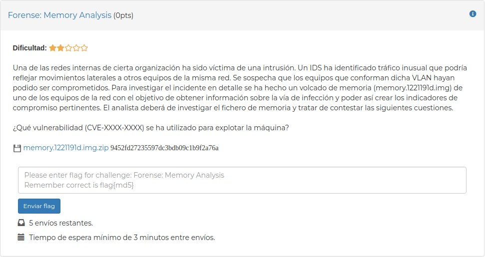
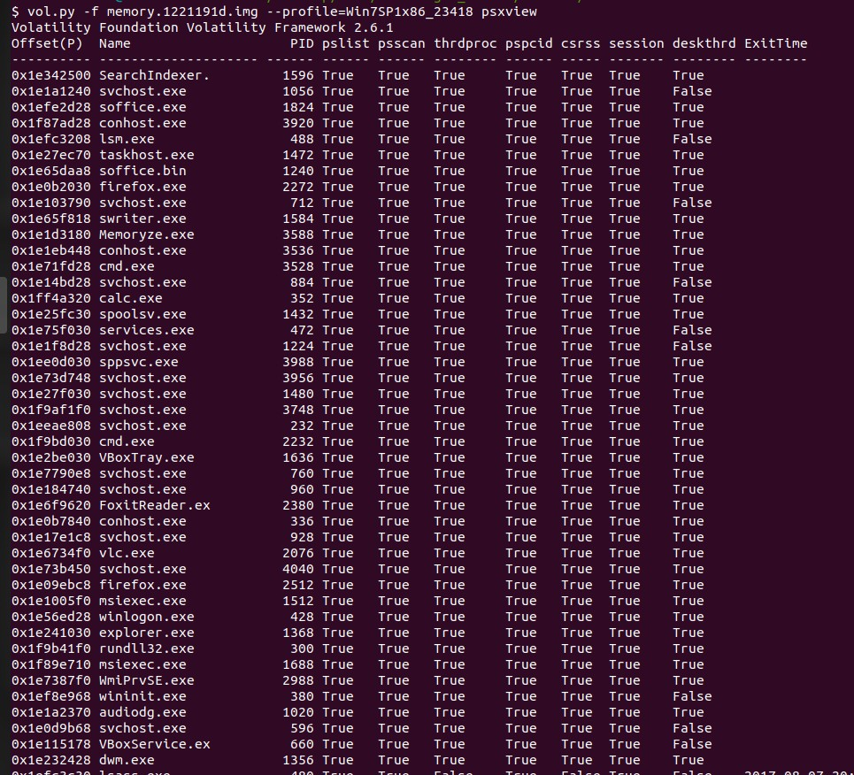
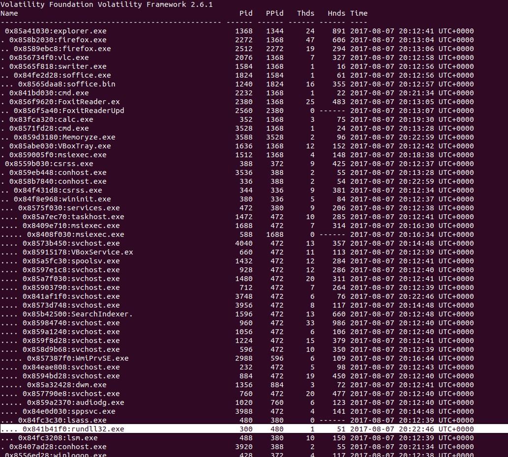
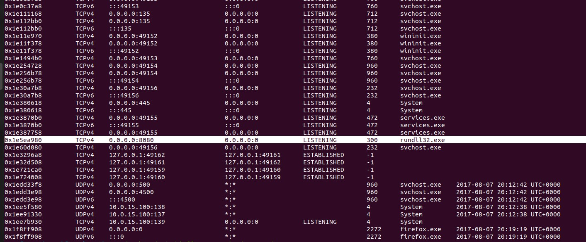
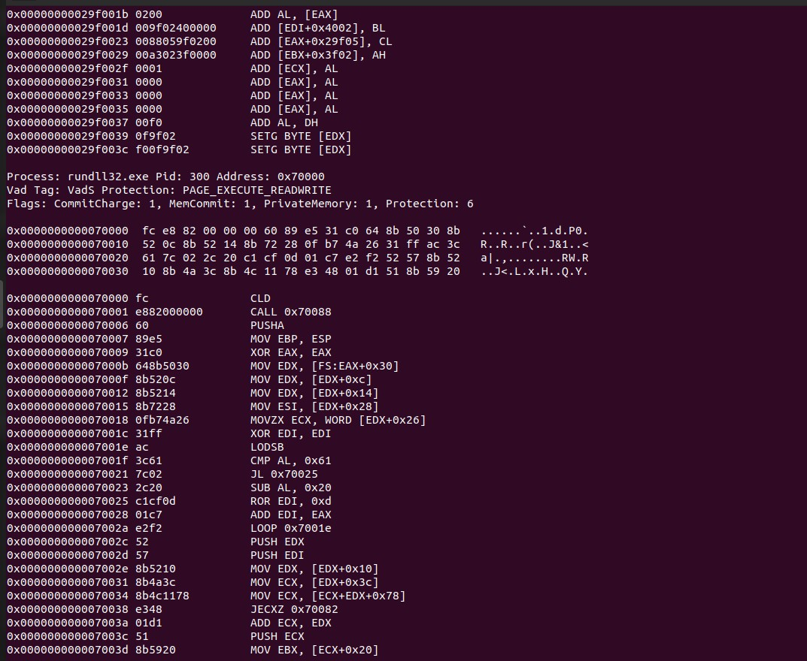
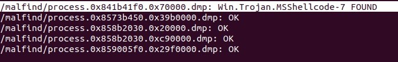
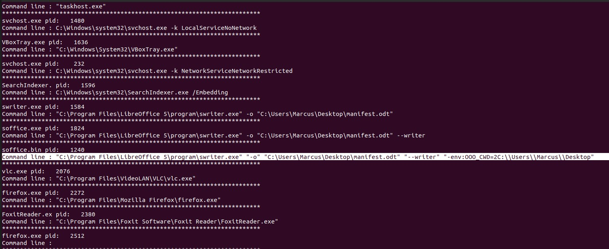
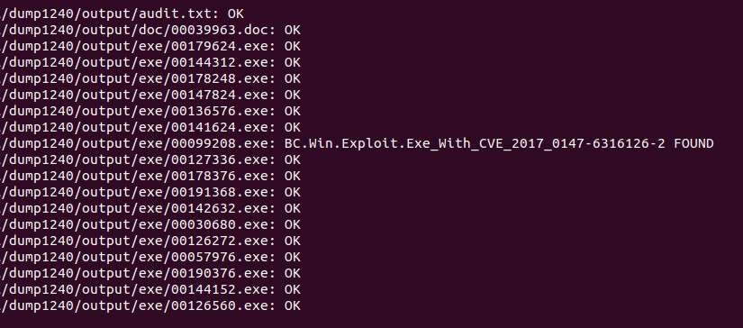

# CVE Challenge 

## Introduction


This challenge asks for finding out which was the CVE of the vulnerability exploited by the adversary for compromising the machine. 

the following [memory dump](https://atenea.ccn-cert.cni.es/static/b04ec0ade3d49b4a/memory.1221191d.img.zip).


## Solution

The first step is to find out which is the profile of the memory dump. 
onso
```
vol.py -f memory.1221191d.img imageinfo
```
Once we know the profile, we can go ahead and check out what processes were running in the machine in order to find anything suspicious. I like to use the pstree and psxview plugins and compare the outputs from both plugins.

```
vol.py -f memory.1221191d.img --profile=Win7SPx86_23418 psxview
```


```
vol.py -f memory.1221191d.img --profile=Win7SPx86_23418 pstree
```



The output of the pstree plugin shows also the parent processes. At glance, it can be seen a suspicious process with pid=300. The rundll32 process that has as parent process lsass.exe, is an outlier and it could be a good starting point for the investigation.

After checking the processes, I like to check open connections in the machine and try to correlate the suspicious processes with open connections. The suspicious process (pid=300) it's listening at port 8080 waiting for connections. This seems also suspicious.



It's time to check if there have been any potential process injections using the malfind plugin. The image below shows how the suspicious process has a PAGE_EXECUTE_READWRITE page that might be related to a process injection.



Let's analyse the process 300 more in-depth. Using option -D, all the suspicious processes found by malfind will be dumped into the selected path.
```
vol.py -f memory.1221191d.img --profile=Win7SPx86_23418 malfind -D ./malfind/
```
Once all the suspicious processes are dumped, we can go ahead and run a clamscan within the directory. As we can see, a shellcode has been found.




The challenge asks for a CVE, so we keek with our investigation. Sometimes it is useful to check the history of the command line, using plugins such as cmdline, consoles or cmdscan.

```
vol.py -f memory.1221191d.img --profile=Win7SPx86_23418 cmdline
```



Looking at the output of cmdline, we can see something that looks odd at process 1240. It doesn't look such as a common way of using LibreOffice, so let's dump the whole memory of process 1240 using the memdump plugin.

```
vol.py -f memory.1221191d.img --profile=Win7SPx86_23418 memdump --pid=1240 -D ./dump1240/
```

After dumping the whole memory of the process, we use foremost for carving the memory of the process and trying to recover files for scanning them with clamscan.


```
foremost /dump1240/*
clamscan /dump1240/output/*
```

Finally, clamscan has found what we were looking for, the CVE. The image below shows the output of clamscan and how an exploit for the CVE-2017-0147 was found.




## Summary

1.  As usual, the first step is to use the imageinfo plugin for finding out the profile of the memory image.
2.  Using the psxview and pstree plugins, a potential suspicious process was spotted(pid=300).
3.  We take a look at the open connections using the netscan plugin for correlating suspicious connections with the suspicious processes.
4.  We use malfind for looking for potential injections and the plugin finds a potential process injection in the suspicious process.
5.  The suspicious memory region of the process is dumped and we use clamscan for scanning it. Clamscan finds a shellcode.
6.  We keep with our investigation and we look for the commands that were run in the machine with the cmdline plugin. There is something odd in process 1240. We dump the whole memory using the memdump plugin.
7.  Using foremost the dump is carved and we scan the files found by foremost using clamscan. Finally, the exploit is foun
