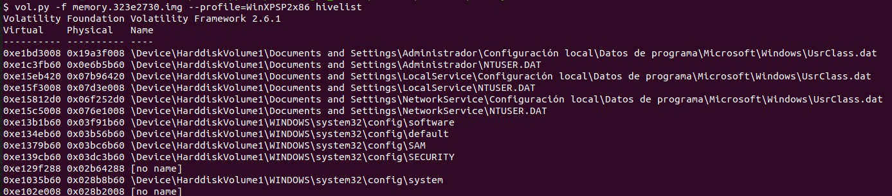
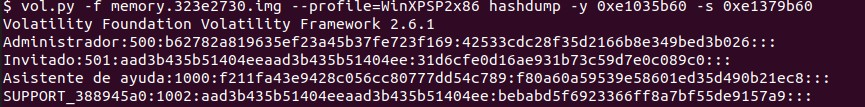
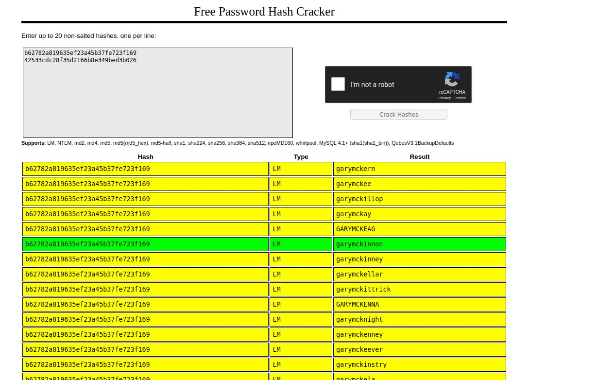

# Password Challenge 

## Introduction


This challenge asks for recovering the administrator password from the following [memory dump](https://atenea.ccn-cert.cni.es/download?file_key=c74f129520807afe28484ceacf7549d71cd897477e0ba5b72310a3155c55ce21&team_key=e3caeea2e58ae01e8b9ed16d1d21b348341477518754ef6396cc0065a72c31eb).


## Solution

The first step is to find out which is the profile of the memory dump. 

```
vol.py -f memory.323e2730.img  imageinfo
```
Once that we know the profile, we can extract the list of registry hive in the memory dump. To achieve this, we will use the hivelist plugin. 

```
vol.py -f memory.323e2730.img  --profile=WinXPSP2x86 hivelist
```



The above schreenshot show the list of registry hives and their virtual offsets. We will use the virtual offset of the SYSTEM and SAM registries for extracting the hashes with the hashdump plugin.





Finally, we can crack the Administrator's password using an online service such as crackstation.net.




## Summary

1.  The first step, as usual, to find out the profile of the image.
2.  Since the challenge asks for the password, the more straightforward way is to dump the registry hives.
3.  Using the offset of the System and SAM regisries, we dump the  password hashes with the hashdump plugin.
4.  We use crackstation for dumping the hashes and there was a match.
