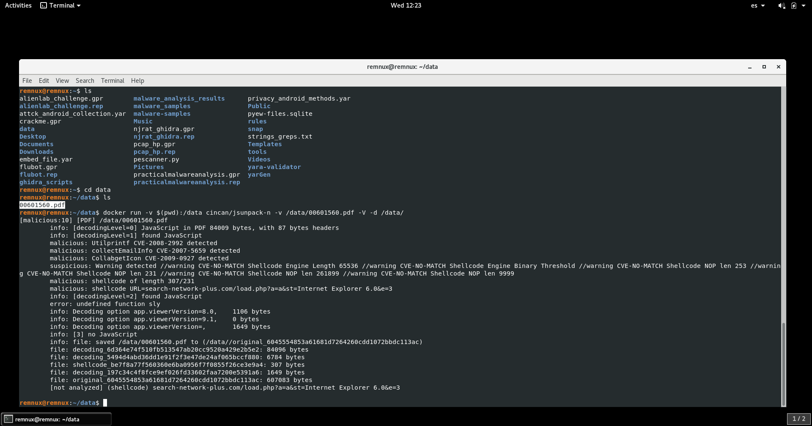

# Cyberdefenders: Banking Troubles

## Description

Company X has contacted you to perform forensics work on a recent incident that occurred. One of their employees had received an e-mail from a co-worker that pointed to a PDF file. Upon opening, the employee did not notice anything; however, they recently had unusual activity in their bank account.

The initial theory is that a user received an e-mail, containing an URL leading to a forged PDF document. Opening that document in Acrobat Reader triggers a malicious Javascript that initiates a sequence of actions to take over the victim's system.

Company X was able to obtain a memory image of the employee's virtual machine upon suspected infection and asked you to analyze the virtual memory and provide answers to the questions.

## Solution


### 1)	What was the local IP address of the victim's machine?
```
vol.py -f Bob.vmem imageinfo
vol.py -f Bob.vmem --profile=WinXPSP2x86 connections

```
### 2)	What was the OS environment variable's value?
```
vol.py -f Bob.vmem --profile=WinXPSP2x86 envars |grep -i os

```

### 3)	What was the Administrator's password?
```
vol.py -f Bob.vmem --profile=WinXPSP2x86 hashdump

```
Use [crackstation](https://crackstation.net/) for cracking the Administrator's password.

### 4)	Which process was most likely responsible for the initial exploit?
```
vol.py -f Bob.vmem --profile=WinXPSP2x86 psxview
```

### 5)	What is the extension of the malicious file retrieved from the process responsible for the initial exploit?

The suspicious process pretends to be Acrobat Reader, so it's very likely that the extension of the exploit is PDF.

### 6)	Suspicious processes opened network connections to external IPs. One of them starts with "2". Provide the full IP.

```
vol.py -f Bob.vmem --profile=WinXPSP2x86 connections
vol.py -f Bob.vmem --profile=WinXPSP2x86 pstree
```

### 7)	A suspicious URL was present in process svchost.exe memory. Provide the full URL that points to a PHP page hosted over a public IP (no FQDN).

```
strings Bob.vmem |grep "^http://"|sort|uniq |grep "php"

```

### 8)	Extract files from the initial process. One file has an MD5 hash ending with "528afe08e437765cc". When was this file first submitted for analysis on VirusTotal?

```
vol.py -f Bob.vmem --profile=WinXPSP2x86 memdump -p 1752 -D .
foremost 1752.dmp
cd /output/pdf
md5sum * |grep 528afe08e437765cc

```
Go to VirusTotal and check out the first submission date.

### 9)	What was the PID of the process that loaded the file PDF.php?

```
vol.py -f Bob.vmem --profile=WinXPSP2x86 psxview

```

### 10)	The JS includes a function meant to hide the call to function eval(). Provide the name of that function.

```
peepdf -i 00601560.pdf
PPDF> object 11
PPDF> object 1054
```


Go to an online JS beautifer such as [beautifer.io](https://beautifier.io/) and paste the JS dumped.


### 11)	The payload includes 3 shellcodes for different versions of Acrobat reader. Provide the function name that corresponds to Acrobat v9.

```
js-ascii js_dumped.js
```


### 12)	Process winlogon.exe hosted a popular malware that was first submitted for analysis at VirusTotal on 2010-03-29 11:34:01. Provide the MD5 hash of that malware.

```
vol.py -f Bob.vmem --profile=WinXPSP2x86 malfind -p 644 -D ./maldump/
md5sum ./maldump/*
```

### 13)	What is the name of the malicious executable referenced in registry hive '\WINDOWS\system32\config\software', and is variant of ZeuS trojan?

```
vol.py -f Bob.vmem --profile=WinXPSP2x86 filescan | grep -i ".exe"
```
Look for suspcious executables and google them.

### 14)	The shellcode for Acrobat v7 downloads a file named e.exe from a specific URL. Provide the URL.

```
strings Bob.vmem |grep "http://"|sort|uniq 
```

### 15)	The shellcode for Acrobat v8 exploits a specific vulnerability. Provide the CVE number.
Use jsunpack to find out the CVE exploited. You can use the Cincan toolkit, which is a set of IR dockerized tools.

```
docker run -v $(pwd):/data cincan/jsunpack-n -v data/00601560.pdf -V -d /data/
```



