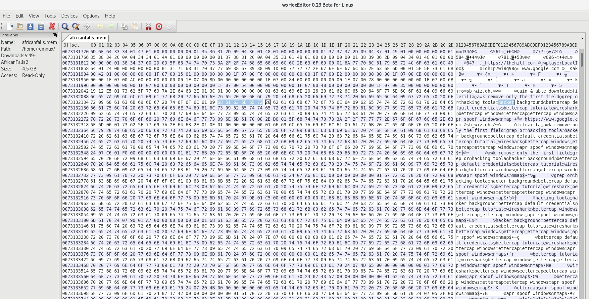

# Cyberdefenders: Brave

## Description

A memory image was taken from a seized Windows machine. Analyze the image and answer the provided questions.

## Solution

	
### 1) What time was the RAM image acquired according to the suspect system? (YYYY-MM-DD HH:MM:SS)
```
vol3 -f africanfalls.mem windows.info
```

#### 2) What is the SHA256 hash value of the RAM image?
```
sha256sum africanfalls.mem
```

### 3)	What is the process ID of "brave.exe"?
```
vol3 -f africanfalls.mem windows.pslist | grep "brave.exe"
```

### 4)	How many established network connections were there at the time of acquisition? (number)

```
vol3 -f africanfalls.mem windows.netscan | grep -c "ESTABLISHED"
```

### 5)	What FQDN does Chrome have an established network connection with?


```
vol3 -f africanfalls.mem windows.netscan | grep "chrome"
dig -x 185.70.41.130
```

### 6)	What is the MD5 hash value of process memory for PID 6988?

```
vol3 -f africanfalls.mem windows.pslist --pid=6988 --dump 
 md5sum pid.6988.0x1c0000.dmp
```
### 7) What is the word starting at offset 0x45BE876 with a length of 6 bytes?

Open your favourite Hex editor and go to the 0x45BE876 offset.
 

### 8)	What is the creation date and time of the parent process of "powershell.exe"? (YYYY-MM-DD HH:MM:SS)


```
vol3 -f africanfalls.mem -windows.pstree | grep "powershell"
```

### 9)	What is the full path and name of the last file opened in notepad?

```
vol3 -f africanfalls.mem windows.cmdline | grep "notepad"
```

### 10)	How long did the suspect use Brave browser? (hh:mm:ss)

```
vol3 -f africanfalls.mem windows.registry.userassist| grep "brave"
```