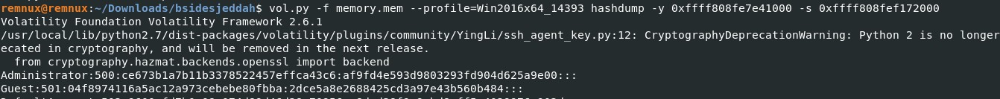
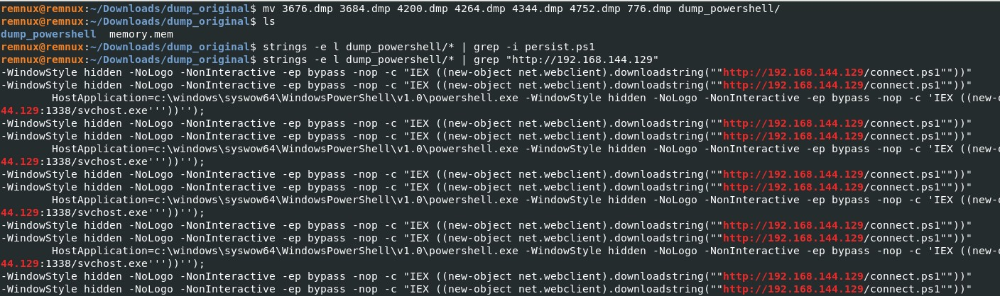

# Cyberdefenders: BsidesJeddah

## Description

The #NSM gear flagged suspicious traffic coming from one of the organization's web servers. Analyze the server's captured memory image and figure out what happened.

## Solution

### 1)	What is the SHA256 hash value of the RAM image?
```
sha256sum memory.mem
```

### 2)	What time was the RAM image acquired according to the suspect system? (YYYY-MM-DD HH:MM:SS)
``` 
vol.py -f memory.mem imageinfo
```


### 3)	What volatility2 profile is the most appropriate for this machine. imageinfo will take a long try to figure another way to determine the profile? (ex: Win10x86_14393)
```
vol.py -f memory.mem imageinfo
```

### 4)	What is the computer's name?
```
vol.py -f memory.mem --profile=Win2016x64_14393 hivelist
vol.py -f memory.mem --profile=Win2016x64_14393 printkey -o 0xffff808fe7e41000 -K 'ControlSet001\Control\ComputerName\ComputerName'
```


### 5)	What is the system IP address?

```
vol.py -f memory.mem --profile=Win2016x64_14393 netscan
```

### 6)	How many established network connections were at the time of acquisition?
```
vol.py -f memory.mem --profile=Win2016x64_14393 netscan | grep "ESTABLISHED" | wc -l
```

### 7)	What is the PID of explorer.exe?
```
vol.py -f memory.mem --profile=Win2016x64_14393 pslist | grep "explorer"
```

### 8)	What is the title of the webpage the admin visited using IE?
```
vol.py -f memory.mem --profile=Win2016x64_14393 iehistory
```
### 9)	What company developed the program used for memory acquisition?

```
vol.py -f memory.mem --profile=Win2016x64_14393 cmdline
```
### 10)	What is the administrator user password?
```
vol.py -f memory.mem --profile=Win2016x64_14393 hashdump
```


### 11)	What is the version of the WebLogic server installed on the system?

```
vol.py -f memory.mem --profile=Win2016x64_14393 memdump --pid=4752 -D .
strings 4752.dmp | grep "version"

```
### 12)	The admin set a port forward rule to redirect the traffic from the public port to the WebLogic admin portal port. What is the public and WebLogic admin portal port number? Format PublicPort:WebLogicPort (22:1337)
```
vol.py -f memory.mem --profile=Win2016x64_14393 netscan
```
### 13)	The attacker gain access through WebLogic Server. What is the PID of the process responsible for the initial exploit?
```
vol.py -f memory.mem --profile=Win2016x64_14393 netscan
```

### 14)	what is the PID of the next entry to the previous process? (Hint: ActiveProcessLinks list)
```
vol.py -f memory.mem --profile=Win2016x64_14393 cmdline
```

### 15)	How many threads does the process responsible for the initial exploit have?
```
vol.py -f memory.mem --profile=Win2016x64_14393 pslist | grep "4752"
```
### 16)	The attacker gain access to the system through the webserver. What is the CVE number of the vulnerability exploited?
```
vol.py -f memory.mem --profile=Win2016x64_14393 memdump -n powershell -D .
```

### 17)	The attacker used the vulnerability he found in the webserver to execute a reverse shell command to his own server. Provide the IP and port of the attacker server? Format: IP:port
```
vol.py -f memory.mem --profile=Win2016x64_14393 netscan
```

### 18)	multiple files were downloaded from the attacker's web server. Provide the Command used to download the PowerShell script used for persistence?
```
vol.py -f memory.mem --profile=Win2016x64_14393 cmdline
```


### 19)	What is the MITRE ID related to the persistence technique the attacker used?
```
vol.py -f memory.mem --profile=Win2016x64_14393 cmdline

Command line : "C:\Windows\system32\mmc.exe" "C:\Windows\system32\taskschd.msc" /s

Check out the MITRE ATT&CK Matrix with this persistence technique.

```

### 20)	After maintaining persistence, the attacker dropped a cobalt strike beacon. Try to analyze it and provide the Publickey_MD5.
```
vol.py -f memory.mem --profile=Win2016x64_14393 malfind
vol.py -f memory.mem --profile=Win2016x64_14393 memdump --pid 1488 -D .
python3 parse_beacon_config.py pid.1488.dmp
```

### 21)	What is the URL of the exfiltrated data?
```
vol.py -f memory.mem --profile=Win2016x64_14393 memdump -n notepad.exe -D .

```
