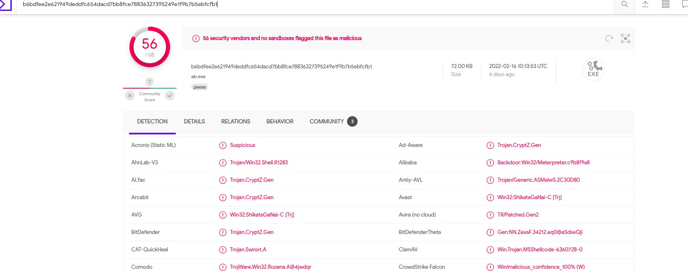

# Cyberdefenders: DumpMe

## Description

One of the SOC analysts took a memory dump from a machine infected with a meterpreter malware. As a Digital Forensicators, your job is to analyze the dump, extract the available indicators of compromise (IOCs) and answer the provided questions.


## Solution

### 1	What is the SHA1 hash of Triage-Memory.mem (memory dump)?
```
shasum Triage-Memory.mem 
```

### 2	What volatility profile is the most appropriate for this machine? (ex: Win10x86_14393)
First profile suggested by kdbgscan or imageinfo plugins.
```
vol.py -f Triage-Memory.mem kdbgscan
```

### 3	What was the process ID of notepad.exe?
```
vol.py -f Triage-Memory.mem --profile=Win7SP1x64 pslist | grep "notepad"
```

### 4	Name the child process of wscript.exe.
```
vol.py -f Triage-Memory.mem --profile=Win7SP1x64 pslist | grep "wscript.exe" -A 4
```

### 5	What was the IP address of the machine at the time the RAM dump was created?
```
vol.py -f Triage-Memory.mem --profile=Win7SP1x64 netscan
```
Check the IPs in the local address column.

### 6	 Based on the answer regarding the infected PID, can you determine the IP of the attacker?
```
vol.py -f Triage-Memory.mem --profile=Win7SP1x64 netscan | grep "UWkpjFjDzM.exe"
```
Check the IPs in the foreign address column.

### 7	How many processes are associated with VCRUNTIME140.dll?
```
vol.py -f Triage-Memory.mem --profile=Win7SP1x64 dlllist | grep "VCRUNTIME140.dll" | wc -l
```
### 8	After dumping the infected process, what is its md5 hash?
```
vol.py -f Triage-Memory.mem --profile=Win7SP1x64 procdump --pid 3496 -D .

md5sum executable.3496.exe
```
### 9	What is the LM hash of Bob's account?
```
vol.py -f Triage-Memory.mem --profile=Win7SP1x64 procdump hashdump | grep "Bob"
```

### 10	What memory protection constants does the VAD node at 0xfffffa800577ba10 have?
```
vol.py -f Triage-Memory.mem --profile=Win7SP1x64 vadinfo | grep "0xfffffa800577ba10" -A 4 -B 4
```

### 11	What memory protection did the VAD starting at 0x00000000033c0000 and ending at 0x00000000033dffff have?
```
vol.py -f Triage-Memory.mem --profile=Win7SP1x64 vadinfo | grep "0x00000000033c0000" -A 4 -B 4
```

### 12	There was a VBS script that ran on the machine. What is the name of the script? (submit without file extension)

```
vol.py -f Triage-Memory.mem --profile=Win7SP1x64 cmdline | grep "VBS"
```

### 13	An application was run at 2019-03-07 23:06:58 UTC. What is the name of the program? (Include extension)
```
vol.py -f Triage-Memory.mem --profile=Win7SP1x64 shimcache
| grep "2019-03-07 23:06:58"
```
Shimcache plugin parses the Shimcache registry, which contains a list of executed programs. 
### 14	What was written in notepad.exe at the time when the memory dump was captured?
```
vol.py -f Triage-Memory.mem --profile=Win7SP1x64 memdump -p 3032 -D .

strings -e l 3032.dmp | grep "flag<"
```
### 15	What is the short name of the file at file record 59045?
```
vol.py -f Triage-Memory.mem --profile=Win7SP1x64 mtfparser | grep "59045"
-A 20
```
### 16	This box was exploited and is running meterpreter. What was the infected PID?

```
vol.py -f Triage-Memory.mem --profile=Win7SP1x64 pstree

```

A suspicious process named UWkpjFjDzM.exe can be spotted. Let's dump it, find out its md5hash and check it out on Virus Total.

```
vol.py -f Triage-Memory.mem --profile=Win7SP1x64 procdump --pid 3496 -D .

md5sum executable.3496.exe
```

