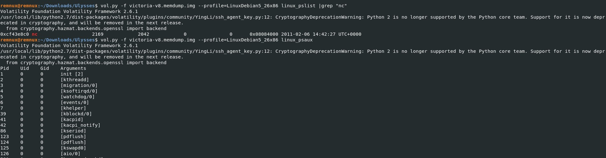
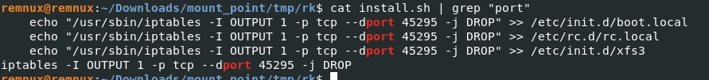

# Cyberdefenders: Ulysses

## Description

A Linux server was possibly compromised and a forensic analysis is required in order to understand what really happened. Hard disk dumps and memory snapshots of the machine are provided in order to solve the challenge.

Challenge Files:

* victoria-v8.kcore.img: memory dump done by dd’ing /proc/kcore.
* victoria-v8.memdump.img: memory dump done with memdump.
* Debian5_26.zip: volatility custom Linux profile


# Solution
Before starting analyse the memory dump with Volatility, we mount the hard disk for checking the OS logs.

```bash
mkdir mount_point
sudo mount -o loop victoria-v8.sda1.img mount_point/
sudo cat mount_point/var/log/auth.log |grep ""
```


### 1)	The attacker was performing a Brute Force attack. What account triggered the alert?


```
sudo cat ./mount_point/var/log/auth.log |grep "user"
```

### 2)	How many were failed attempts there?

```
cat ./mount_point/var/log/auth.log | grep "Failed"|wc -l
```

### 3)	What kind of system runs on the targeted server?
```
cat ./mount_point/etc/issue.net
```
### 4)	What is the victim's IP address?
```
cat ./mount_point/etc/issue.net
```

### 5) What are the attacker's two IP addresses? Format: comma-separated in ascending order
```
vol.py -f victoria-v8.memdump.img --profile=LinuxDebian5_26x86 linux_netstat
```

### 6)	What is the "nc" service PID number that was running on the server?

```
vol.py -f victoria-v8.memdump.img --profile=LinuxDebian5_26x86 linux_pslist |grep "nc"
```
### 7)	What service was exploited to gain access to the system? (one word)
```
vol.py -f victoria-v8.memdump.img --profile=LinuxDebian5_26x86 linux_psaux
```


### 8)	What is the CVE number of exploited vulnerability?
Google Exim4 CVE 2010 and you will find out.

### 9)	During this attack, the attacker downloaded two files to the server. Provide the name of the compressed file.
```
ls ./mount_point/tmp/
```

### 10)	Two ports were involved in the process of data exfiltration. Provide the port number of the highest one.
```
vol.py -f victoria-v8.memdump.img --profile=LinuxDebian5_26x86 linux_netstat
```

### 11)	Which port did the attacker try to block on the firewall?


```bash
cd mount_point/tmp/
sudo tar xvf rk.tar
cd rk
cat install.sh |grep "port"
```
