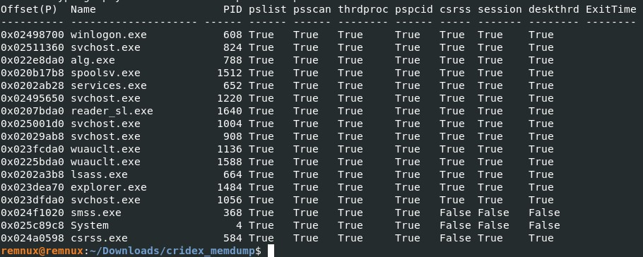
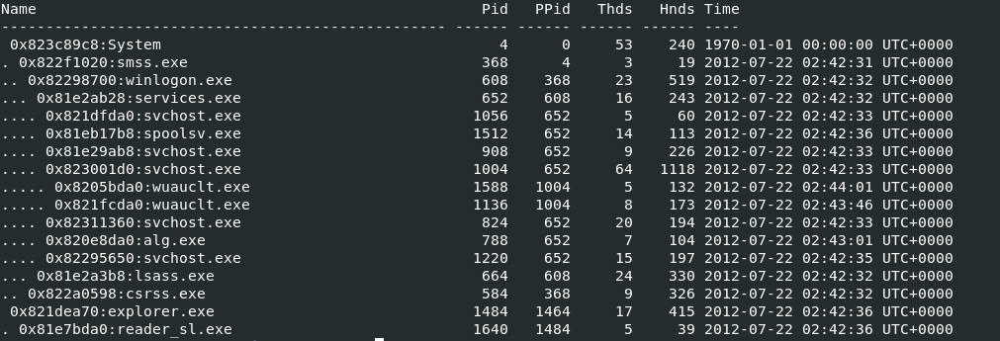
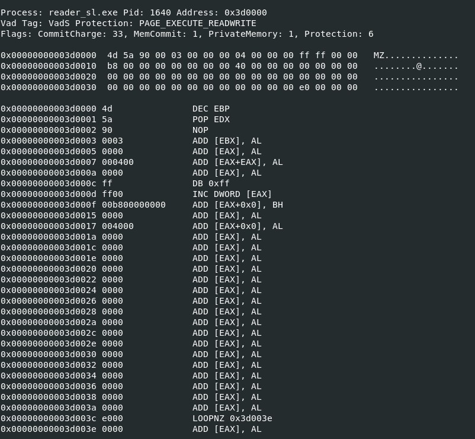
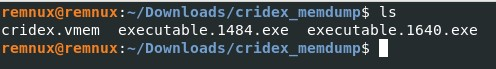
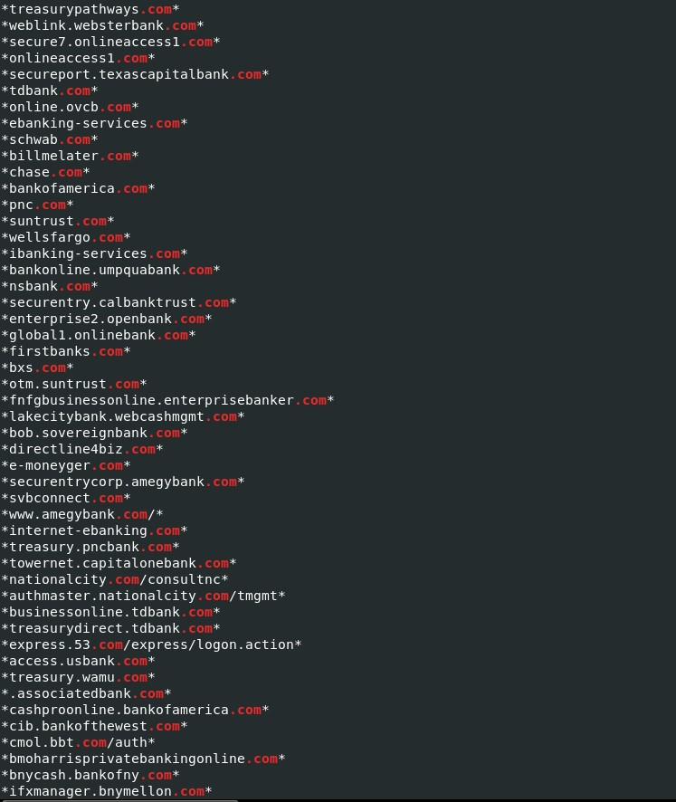
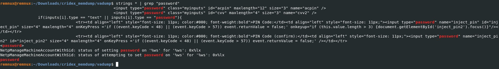
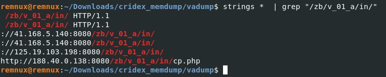

# Cridex 

## Introduction
Cridex (also known as Feodo or Bugat) was a banking trojan targeting banks from around the world. The trojan was designed for stealing sensitive information from victims, such as credit cards details or credentials.

According to [Kaspersky](https://securelist.com/dridex-a-history-of-evolution/78531/), the malware made its first appearance around September 2011. Cridex had some connections with the Zeus Trojan and it was the predecessor of the Dridex trojan.

The Volatility Foundation provides a list of public memory dumps available on their Github. This is a good resource to keep learning and improving Memory Forensics and Malware Analysis skills.


## Analysis

The first step is to find out which is the profile of the memory dump. This is only needed for Volatility 2, since Volatility 3 doesn't have profiles. If you are using Volatility2, you will have to use image info or kdgbscan plugins for checking what are the profiles suggested by these plugins.

```
vol.py -f cridex.vmem imageinfo
```

Once we know what profile suits better with the memory image, we can go ahead and check what are the processes that were running inside the infected computer. Personally, I like to use the plugin psxview, which uses multiple methods for detecting processes and shows which ones are and aren't detected. Another useful plugin that I like to use, it's the pstree plugin for seeing the relationship among processes at glance.

```
vol.py -f cridex.vmem --profile=WinXP psxview
```


```
vol.py -f cridex.vmem --profile=WinXP pstree
```


After running both commands, I noticed that there were a few things that might be odd. In the pstree output, the process reader_sl.exe related to Adobe, and explorer.exe start exactly at the same time. Besides, the explorer.exe (pid==1484) has a parent process (ppid=1464) that is not listed in the psxview output. This might be a very good starting point for keeping with the investigation.

Before analysing the suspicious process more in-depth, I checked the network connections. To achieve this, we can use several plugins, for instance, connections and connscan, in order to compare the outputs from both plugins. The connscan plugin will carve the memory dump looking for network activity artifacts.

```
vol.py -f cridex.vmem --profile=WinXP conections
```

```
vol.py -f cridex.vmem --profile=WinXP netscan
```


After running the previous commands, we can see 2 open connections that were open by process 1484, the suspicious process.

It seems that we are closer, so the next step would be to run the malfind plugin in order to look for page_executable zones in memory. We can inspect the suspicious process(--pid=1484) or we can run it without any process id and it will look in the whole memory.

```
vol.py -f cridex.vmem --profile=WinXP malfind
```




The malfind output shows 2 PEs in process 1640 and 1484. Let's dump the 2 process using the procdump plugin:
```
vol.py -f cridex.vmem --profile=WinXP procdump --pid=1484 -D .
```


After dumping both executables, I checked their md5 hashes to check if they were uploaded on VirusTotal. Obviously, they were already uploaded by someone else, since this malware is very old and the first submission of both executables was in 2012. [Here](https://www.virustotal.com/gui/file/48db195007e5ae9fc1246506564af154927e9f3fbfca0b4054552804027abbf2/detection) is the link to VT for process 1484 and [here](https://www.virustotal.com/gui/file/5b136147911b041f0126ce82dfd24c4e2c79553b65d3240ecea2dcab4452dcb5/details) for process 1640.

Another quick check that might be useful is to check the strings in the dumped files and filter the output using grep for finding potential IoCs(e.g., urls, C&C). However, after running the strings command we didn't find anything interesting. Let's check also the strings in the VAD(Virtual Address Descriptors) segments, which contains information about allocated memory segments in a process and it can be useful for finding hidden or injected code.

```
vol.py -f cridex.vmem --profile=WinXPSP2x86 vaddump -p 1484 -D ./vadump_1484/
```

Using a simple grep and looking for ".com" shows the financial instituions that this malware campaign was targeting.



Another simple search with grep using "password", shows a potential code injection used by the malware author for stealing banking credentials when the user tried to connect to the bank website.



Finally, we will look for the IPs discovered with the connscan plugin, "41.168.5.140" and "125.19.103.198". The idea is to use the hits of the search for pivoting and trying to discover new C&C IPs. For instance, one of the searches showed more information about the request to the 41.168.5.140 IP. It seems that the malware was trying to connect to the following URL: **41.168.5.140:8080/zb/v_01_a/in/**

The previous string, "/zb/v_01_a/in/", can be usedfor looking for more hits.



As a result, a new IP was discovered: 188.40.0.138.

## Summary

1.  Using the psxview and pstree plugins, a potential suspicious process was spotted.
2.  After running the connscan and netscan plugins, we saw 2 suspcious connected openen by the suspicious process.
3.  The malfind plugin found 2 potential malicious executables in 2 processes, the 1484 and 1640. We dumped both processes and check out their respective hashes on VirusTotal.
4.  We dumped the VAD segment of both processes, we ran the strings command with a grep for looking for injected code as well as IoC's.